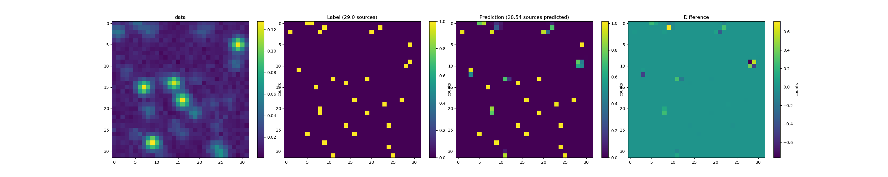
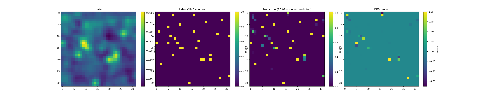
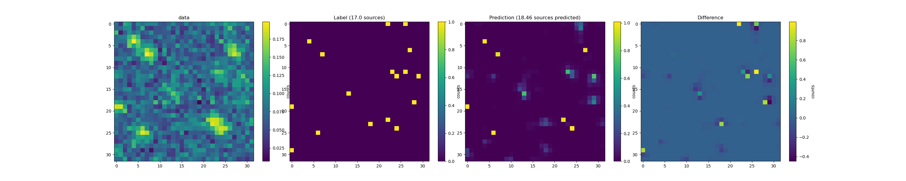
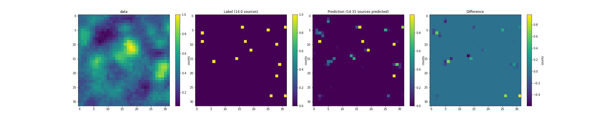

# source-position-reconstruction

This project is an attempt to develop a simulation, data from which are used for training the Neural Network model and predictions are done in order to identify Astonomical poin sources. The imitaion considerations are focusing on low resolution images obtained from telescopes such as Fermi-LAT, which is gamma ray telescope. The idea of the project is to reduce "reality gap" between the theoretical aspects(used in simulations) and Galactic Center Excess in gamma-ray domain.

The modeling of simulation considers the gaussian profile for source, for instrumental noise posisson noise is used and for diffused emission it considers perlin noise. Perlin noise is used with different octaves, which provides effect of emission form different segments thorough the depth of the view, and outputs resultant image of the region of interest. We also used the analytical relation between the flux from the source and number of source in the image. All the generated data are stored as numpy format. The labels consists information of number of source located at related particular positions.

The first column of images are test data, second columns are labels associated with test data, third columns are predictions of CNN (UNet architecture) and fourth columns are difference between truth and prediction. The simulation also has function of adjusting signal to noise ratio, according to which the user can generate data for desired cases. First row is for low noise scenario. Second row is example of only perlin noise, third row has only poisson noise added with sources, and final row consists both types of noise with random source distribution.

